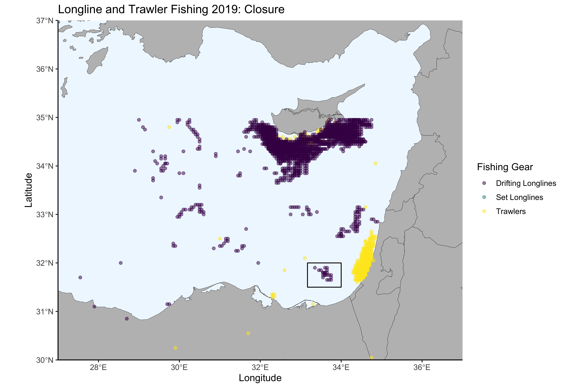

# Mediterranean Sea Fishing Activity 2019

### Purpose

Basic coding test for Fisheries Analyst position at Global Fishing Watch 2021.

### Background

Data files are fishing activity in the Mediterranean Sea from 2019. Fishing hours are binned on a 0.05 degree grid. Shapefiles are of closed fishing areas.

------------------------------------------------------------------------

